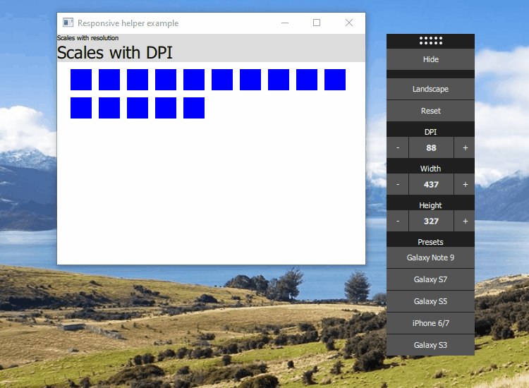
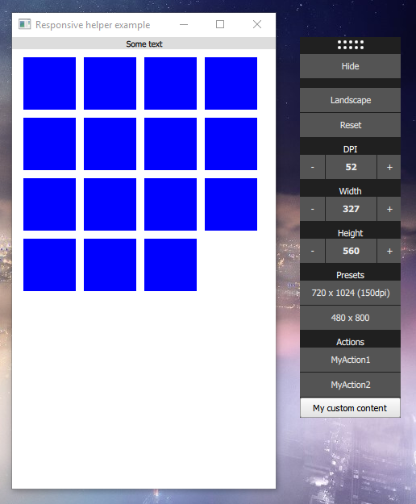

# Qt Quick Responsive Helper
A simple helper window for QtQuick based applications, to let developers test different resolutions and dpi settings easily. It was made to be integrated with minimal effort ([only one QML file](ResponsiveHelper.qml)), and to be configurable for your specific usage.

## Main features
- Manually set application width and height
- Manually set dpi / pixelDensity (independent from Screen.pixelDensity)
- Toggle between landscape and portrait mode
- Use presets to quickly test your commonly used settings
- Add buttons to manage custom actions, or even custom content to the bar
- Can be disabled for production with a single property

Compatible with Qt 5.2 and higher, requires only QtQuick 2 and QtQuick Window module (for now).



## Installation

You can either:

- Copy [ResponsiveHelper.qml](ResponsiveHelper.qml) into your project
- or clone the repository (`--recursive`) and use it as you see fit. The `examples` folder contains:
  - [minimal-example](examples/minimal-example/main.qml)
  - [common-features-example](examples/common-features-example/main.qml)

## Minimal working example
Just drop it in your project, and set the `targetWindow` property to be the Window instance of your application:

`main.qml`
```
Window {
    id: window

    ResponsiveHelper {
        targetWindow: window
    }
}
```

## Additional features



### Presets

By default, presets contains the following devices:

* Galaxy Note 9
* Galaxy S7
* Galaxy S5
* iPhone 6/7
* Galaxy S3

Preset will modify automatically your `window` resolution. See [DPI](#dpi) to integrate DPI settings in your application.

You can define a set of custom resolutions/dpi shortcuts using the `presets` property.

`main.qml`
```
Window {
    id: window

    ResponsiveHelper {
        id: helper
        targetWindow: window
        rootItem: rootItem

        // List the presets to be used for your application
        initialPreset: 0
        presets: ListModel {
            ListElement { label: "Galaxy S5"; width: 750; height: 1334; dpi: 326}
            ListElement { label: "Desktop"; width: 1280; height: 1024; dpi: 72 }
        }
    }

    Item {
        id: rootItem
        // Let the helper manage the size and scale of the root Item, based on available space
        anchors.centerIn: parent
        width: parent.width
        height: parent.height

        // <Your content here!>
        // Use `helper.dpi`, `helper.pixelDensity`, `rootItem.width`, or `rootItem.height`
    }
}
```

### DPI

As Qt `Screen.pixelDensity` property cannot be altered, the ResponsiveHelper provides two properties you can use instead:

* The `dpi` property
  * in Dots per inch (actually Pixel per inch here)
* The `pixelDensity` property
  * a drop-in replacement for Qt's `Screen.pixelDensity`, in Pixel per millimeter

`main.qml`
```
Window {
    id: window

    ResponsiveHelper {
        id: helper
        targetWindow: window
        presets: ...
    }
    
    MyHeader {
        width: parent.width
        // 100 pixels high at 72 DPI
        height: 100 * helper.dpi / 72
    }
}
```

### Scaling to fit screen

You can now use the `rootItem` property to define the root element that will be scaled in order to fit the content on the screen. This makes it possible to test high resolutions on a regular monitor.

See the [minimal-example](examples/minimal-example/main.qml) for a working example.

### Additional action buttons

Add additional action buttons with the `actions` property.

```
    // Your custom action buttons
    actions: ListModel {
        ListElement { text: "MyAction1" }
        ListElement { text: "MyAction2" }
    }

    // Handle clicks on your actions
    onActionClicked: {
        console.log("Action " + actionIndex + " clicked")
    }
```

### Custom content

Custom content can also be added to the bar using the `extraContent` property.

```
    // Your buttons or content
    extraContent: [
        Button {
            text: "My Quit Button"
            width: parent.width
            onClicked: {
                window.close()
            }
        }
    ]
```

## Example

The example below show presets, how to add custom actions (buttons) and even arbitrary content to the bar.

`main.qml`
```
// If you placed it in a folder, relative to your main.qml
import "qt-quick-responsive-helper"

Window {
    id: window
    width: 480
    height: 800

    ResponsiveHelper {
        targetWindow: window
        rootItem: root

        anchors.left: parent.right
        anchors.leftMargin: 30

        // List your common presets to be applied to your application
        initialPreset: 0        
        presets: ListModel {
            ListElement { width: 720; height: 1024; dpi: 150 }
            ListElement { width: 480; height: 800 }
        }

        // Handle dpi or pixelDensity changes as you wish, instead of "Screen.pixelDensity"
        onDpiChanged: { }
        onPixelDensityChanged: { }
        
        // Add action buttons
        actions: ListModel {
            ListElement { text: "MyAction1" }
            ListElement { text: "MyAction2" }
        }        
        // Handle clicks on your actions
        onActionClicked: {
            console.log("Action " + actionIndex + " clicked")
        }
        
        // ... Or add your own content directly
        extraContent: [
            Button {
                text: "My custom content"
                width: parent.width
                onClicked: {
                    window.close()
                }
            }
        ]        
    }

    Item {
        id: root
        anchors.centerIn: parent
        width: parent.width
        height: parent.height

        // Your app goes here!
    }
}
```

See the [full QML example](examples/common-features-example/main.qml) for more details.

For additional details, you can have a look at the examples provided with the project, from the [Installation](#installation) chapter.

## Contribution ##
Project is open to contribution, just contact me or directly hack it, if you are willing to help.
